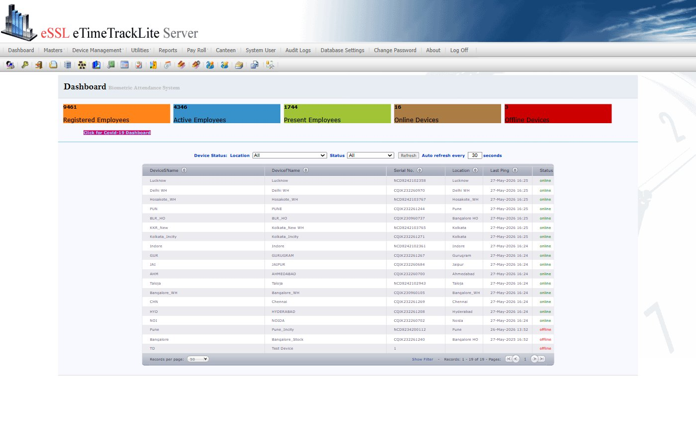

# 🖥️ eSSL Biometric Device Monitor

> Automated biometric attendance device health monitoring for RentoMojo — screenshots the eTimeTrackLite dashboard and emails live device status to stakeholders every 2 hours.

---

## 📊 Dashboard Preview



---

## 📋 Table of Contents

- [Overview](#overview)
- [Features](#features)
- [Architecture](#architecture)
- [Prerequisites](#prerequisites)
- [Installation](#installation)
- [Configuration](#configuration)
- [Usage](#usage)
- [Email Report](#email-report)
- [Devices Monitored](#devices-monitored)
- [Troubleshooting](#troubleshooting)
- [Project Report](#project-report)

---

## Overview

RentoMojo operates **19 biometric attendance devices** across 16+ cities in India. This tool automates health monitoring of all devices by:

1. Logging into the **eSSL eTimeTrackLite** web portal programmatically
2. Selecting **Status = All** to show every device
3. Capturing a **full-page screenshot** of the Device Status dashboard
4. Sending an **HTML email** with the screenshot embedded inline to IT and operations teams
5. Repeating every **2 hours between 08:00 – 20:00 IST**

---

## ✨ Features

| Feature | Detail |
|---|---|
| 🔐 Auto-login | Handles iframe-based login popup automatically |
| 📸 Smart screenshot | Sets zoom 75%, dropdown All, refreshes — then captures |
| 📧 Rich HTML email | Inline screenshot, offline alert block, colour-coded status |
| 🔢 Device count | Parses online/offline count from dashboard dynamically |
| ⏰ Scheduler | Runs every 2 hours within configurable active window |
| 🛡️ Anti-detection | Custom user-agent, non-headless off-screen Chrome |
| 📝 Logging | Full timestamped log to console and `logs/` folder |
| 🚫 Device exclusions | Configurable list of test/staging devices to exclude from counts |

---

## 🏗️ Architecture

```
┌─────────────────────────────────────────────────┐
│              eSSL Biometric Monitor              │
│                                                  │
│  ┌─────────┐    ┌──────────────┐    ┌─────────┐ │
│  │Scheduler│───▶│  Playwright  │───▶│ Gmail   │ │
│  │(2 hrs)  │    │  (Chromium)  │    │  SMTP   │ │
│  └─────────┘    └──────┬───────┘    └────┬────┘ │
│                        │                 │       │
│                 Login → Dashboard        │       │
│                 Set All → Refresh        │       │
│                 Screenshot ─────────────┘       │
└─────────────────────────────────────────────────┘
```

---

## 🔧 Prerequisites

| Requirement | Version | Notes |
|---|---|---|
| Python | 3.9+ | [Download](https://python.org/downloads) — check "Add to PATH" |
| Google Chrome | Latest | [Download](https://google.com/chrome) |
| Gmail Account | — | With 2FA + App Password enabled |
| Network access | — | Must reach `http://35.154.100.94:99` |

---

## 🚀 Installation

### 1. Clone the repository

```bash
git clone https://github.com/rentomojo-it/essl-biometric-monitor.git
cd essl-biometric-monitor
```

### 2. Create a virtual environment

```bash
python -m venv venv

# Windows
venv\Scripts\activate

# macOS / Linux
source venv/bin/activate
```

### 3. Install dependencies

```bash
pip install -r requirements.txt
playwright install chromium
```

---

## ⚙️ Configuration

All settings are at the top of `essl_device_status.py`:

```python
PORTAL_URL         = "http://35.154.100.94:99/iclock/Main.aspx"
USERNAME           = "Dashboard"
PASSWORD           = "your-password"

GMAIL_SENDER       = "sender@gmail.com"
GMAIL_APP_PASSWORD = "xxxx xxxx xxxx xxxx"   # 16-char Gmail App Password
RECIPIENTS         = ["it@company.com", "manager@company.com"]

RUN_EVERY_MINUTES  = 120     # 120 = every 2 hours
START_HOUR         = 8       # 08:00 AM
END_HOUR           = 20      # 08:00 PM

EXCLUDED_DEVICES   = ["Bangalore Stock", "Test Device"]
MONITORED_DEVICES  = 15      # devices counted for online/offline reporting
```

### Gmail App Password Setup

> ⚠️ A Gmail App Password is required — your regular Gmail password will not work.

1. Go to **Google Account → Security → 2-Step Verification** (enable if not done)
2. Go to [https://myaccount.google.com/apppasswords](https://myaccount.google.com/apppasswords)
3. Select App: **Mail** | Device: **Windows Computer** → Generate
4. Copy the 16-character password and paste into `GMAIL_APP_PASSWORD`

---

## ▶️ Usage

### Run manually (once)

```bash
python essl_device_status.py
```

The script runs immediately, then stays alive on the scheduler.

### Run in background (Windows — no console window)

```bash
pythonw essl_device_status.py
```

### Auto-start on Windows boot

1. Press `Win + R` → type `shell:startup` → Enter
2. Create a shortcut to `essl_device_status.py` in that folder

### Run as a Windows Service (production)

Use [NSSM](https://nssm.cc):

```bash
nssm install ESSLMonitor "C:\Python311\python.exe" "C:\path\to\essl_device_status.py"
nssm start ESSLMonitor
```

---

## 📧 Email Report

**Subject:** `Biometric Device Status — 27 May 2026`

**Recipients configured:**

| Team | Email |
|---|---|
| IT | it@rentomojo.com |
| WH Leads | whleads@rentomojo.com |
| Core Ops | core.ops@rentomojo.com |
| City Lead Ops | cityleadops@rentomojo.com |
| LC Leads | lcleads@rentomojo.com |
| HRBP | hrbp@rentomojo.com |
| Admin WH | admin.wh@rentomojo.com |

**Email includes:**
- ✅ All devices online → green confirmation message
- 🔴 Any offline devices → red alert block with device count
- 📸 Full dashboard screenshot embedded inline
- Instructions for warehouse teams to reconnect offline devices

---

## 🗺️ Devices Monitored

| Location | Status |
|---|---|
| Lucknow | Monitored |
| Delhi WH | Monitored |
| Hosakote WH | Monitored |
| Pune | Monitored |
| Bangalore HO | Monitored |
| Kolkata New WH | Monitored |
| Kolkata Incity | Monitored |
| Indore | Monitored |
| Gurugram | Monitored |
| Jaipur | Monitored |
| Ahmedabad | Monitored |
| Taloja | Monitored |
| Bangalore WH | Monitored |
| Chennai | Monitored |
| Hyderabad | Monitored |
| Noida | Monitored |
| Pune Incity | Monitored |
| Bangalore Stock | ⚠️ Excluded from count |
| Test Device | ⚠️ Excluded from count |

---

## 🛠️ Troubleshooting

### Login not working

```
Check: Is PORTAL_URL reachable from this machine?
  → Open http://35.154.100.94:99 in Chrome manually

Check: Are credentials correct?
  → Try logging in manually first

Fix: Increase wait time after page load
  → Change page.wait_for_timeout(2000) to page.wait_for_timeout(5000)
```

### Screenshot is blank or partial

```
Fix 1: Reduce zoom level
  → Change '75%' to '65%' in the zoom line

Fix 2: Increase post-refresh wait
  → Increase page.wait_for_timeout(1000) to 3000 after Status=All

Fix 3: Increase viewport
  → Change viewport width/height to 1920x1080
```

### Dropdown "Status = All" not being set

```
The script uses JavaScript to set all <select> elements to "All".
If the dashboard uses a different label, update the JS condition:
  .find(o => o.text.trim().toLowerCase() === 'all')
Change 'all' to match whatever text your dropdown uses.
```

### Gmail authentication error

```
Fix: Regenerate App Password at https://myaccount.google.com/apppasswords
Ensure: 2-Step Verification is enabled on the Gmail account
Note: App passwords are invalidated if 2FA is disabled/re-enabled
```

### Playwright / Chromium not found

```bash
playwright install chromium
```

---

## 📝 Logs

Logs print to console and are stored in `logs/`:

```
09:00:01  INFO      ==================================================
09:00:01  INFO        Run — 27-05-2026 09:00:01
09:00:01  INFO      ==================================================
09:00:03  INFO      Opening portal ...
09:00:07  INFO      Login frame found: http://35.154.100.94:99/...
09:00:08  INFO      Username filled: input[name='LoginName']
09:00:09  INFO      Login clicked: input[value='Login']
09:00:14  INFO      Dashboard frame: http://35.154.100.94:99/...
09:00:15  INFO      Counts: {'online': 16, 'offline': 3}
09:00:16  INFO      Status=All: True
09:00:18  INFO      Final counts: {'online': 16, 'offline': 3}
09:00:19  INFO      Screenshot saved → essl_dashboard.png
09:00:20  INFO      Screenshot embedded inline in email body.
09:00:21  INFO      ✅ Email sent!
```

---

## 📁 Project Structure

```
essl-biometric-monitor/
├── essl_device_status.py       # Main script (Playwright — current)
├── etime_monitor_legacy.py     # Legacy script (Selenium — v1)
├── requirements.txt            # Python dependencies
├── .gitignore                  # Excludes secrets, logs, screenshots
├── README.md                   # This file
├── SETUP_GUIDE.md              # Step-by-step non-technical setup guide
├── CHANGELOG.md                # Version history
├── docs/
│   ├── Project_Report.pdf      # Full technical project report
│   └── sample_dashboard.png   # Sample dashboard screenshot
├── screenshots/                # Runtime — auto-created (gitignored)
└── logs/                       # Runtime — auto-created (gitignored)
```

---

## 📄 Project Report

Full technical documentation including architecture decisions, challenges overcome, and business impact is available at [`docs/Project_Report.pdf`](docs/Project_Report.pdf).

---

## 🔒 Security

- **Do not commit real credentials** to version control
- Move `PASSWORD` and `GMAIL_APP_PASSWORD` to environment variables or a `.env` file for production
- The `.gitignore` excludes `screenshots/`, `logs/`, and `.env` files

---

## 👤 Maintainer

**IT Team — RentoMojo**
📧 [it@rentomojo.com](mailto:it@rentomojo.com)
👤 Charan Bijapur — [charan.bijapur@rentomojo.com](mailto:charan.bijapur@rentomojo.com)
